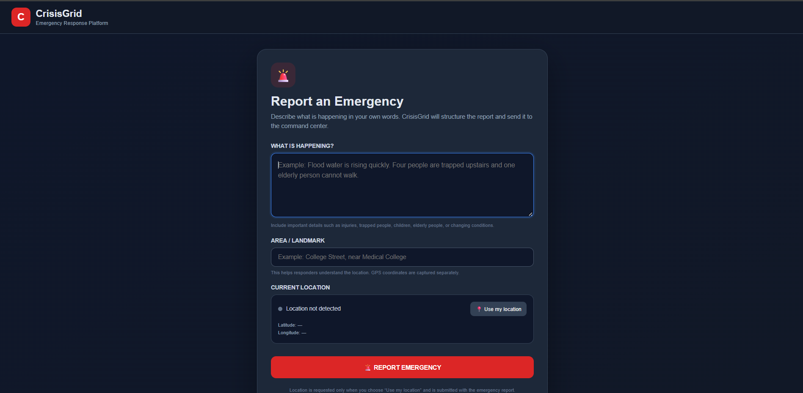
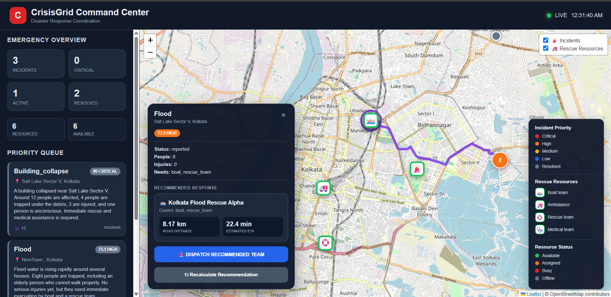
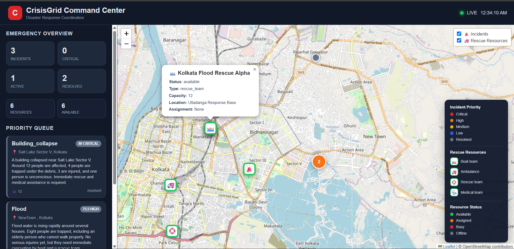

# 🌐 CrisisGrid

### AI-Assisted Disaster Response & Emergency Coordination Platform

> **From emergency reports to prioritized rescue actions.**

CrisisGrid is an AI-assisted disaster response platform designed to help transform unstructured emergency reports into structured incidents, assess their urgency, identify suitable rescue resources, and generate actionable routes for emergency response.

It brings **AI-powered information extraction, priority analysis, resource matching, routing, and geographic visualization** together into a single operational workflow.

---

<p align="center">
<strong>🚨 Report</strong> → <strong>🧠 Understand</strong> → <strong>⚡ Prioritize</strong> → <strong>🚑 Match</strong> → <strong>🗺️ Route</strong> → <strong>📍 Respond</strong>
</p>

---

## 🚧 Project Status

**Active Prototype**

CrisisGrid is currently being developed as a functional prototype demonstrating an integrated disaster-response workflow. Production deployment, large-scale infrastructure, and offline emergency communication are planned as future stages.

---

## ✨ Built With

`Python` · `FastAPI` · `Google Gemini` · `GraphHopper` · `JavaScript` · `Leaflet`

---

## 🧭 What is CrisisGrid?

During a disaster, emergency information can arrive from multiple sources simultaneously, often as incomplete and unstructured natural-language reports.

A single report may contain critical information about **trapped people, injuries, vulnerable individuals, flooding, blocked roads, or required emergency resources**, making manual interpretation and coordination difficult at scale.

The platform integrates **AI-based information extraction, rule-based incident prioritization, resource matching, route generation, and geographic visualization** into a unified pipeline, connecting **report ingestion → incident processing → priority assessment → resource assignment → route planning → dashboard-based coordination**.

## 🎯 The Goal

CrisisGrid is designed to help answer the key questions that arise during emergency response:

* 🚨 **What happened?**
* 📍 **Where is it happening?**
* 👥 **How many people are affected?**
* ⚠️ **How urgent is the situation?**
* 🚑 **What resources are needed?**
* 🧭 **Which available resource can respond?**
* 🗺️ **What route should the response team take?**
* 🚧 **What happens if the route becomes blocked?**

Instead of treating each of these as separate tasks, CrisisGrid connects them into a single response pipeline.


## 🌐 Live Demo

### 📝 Report Portal

Submit emergency reports through the CrisisGrid reporting interface.

**https://crisisgrid-web.vercel.app/report.html**

### 📊 Crisis Dashboard

View submitted incidents, priorities, locations, and resource information.

**https://crisisgrid-web.vercel.app/dashboard.html**

### 🎥 Live Demo Video

Watch a recorded demonstration of the complete CrisisGrid workflow.

**YouTube:** https://youtu.be/DpQ9OZ7B1Po

## 📸 Project Screenshots

### Emergency Reporting Interface



### Live Incident Dashboard



### Command Center



## ⚙️ Deployment

* **Frontend:** Vercel
* **Backend API:** Render — https://crisisgrid-alq9.onrender.com
* **API Documentation:** Swagger UI — https://crisisgrid-alq9.onrender.com/docs

The frontend is deployed on Vercel and communicates with the FastAPI backend deployed on Render.


---

## 💡 Why CrisisGrid?

Traditional emergency reporting can produce large amounts of information that still needs to be manually interpreted, prioritized, and coordinated.

CrisisGrid explores how modern technologies can assist this process by creating a bridge between:

**Human Reports → AI Understanding → Decision Support → Rescue Coordination**

The system is designed to **assist emergency personnel rather than replace human decision-making**, providing structured information and operational support that can help responders make informed decisions.


## ⚙️ How CrisisGrid Works

CrisisGrid connects emergency reporting, AI analysis, prioritization, resource coordination, and routing into a single workflow.

```text
┌──────────────────────┐
│   🚨 Emergency       │
│       Report         │
└──────────┬───────────┘
           │
           ▼
┌──────────────────────┐
│   🧠 AI Extraction   │
│  Structure the data  │
└──────────┬───────────┘
           │
           ▼
┌──────────────────────┐
│   ⚡ Priority Engine  │
│  Assess urgency      │
└──────────┬───────────┘
           │
           ▼
┌──────────────────────┐
│   🚑 Resource        │
│      Matching        │
└──────────┬───────────┘
           │
           ▼
┌──────────────────────┐
│   🗺️ Route           │
│     Generation       │
└──────────┬───────────┘
           │
           ▼
┌──────────────────────┐
│   📍 Operations      │
│      Dashboard       │
└──────────────────────┘
```

### 1. 🚨 Report

An emergency can begin as a natural-language report containing information about the situation, affected people, location, or required assistance.

### 2. 🧠 Understand

The AI layer processes the report and extracts relevant emergency information into a structured format that the rest of the system can work with.

### 3. ⚡ Prioritize

The Priority Engine evaluates the incident using available emergency information and generates a priority assessment.

### 4. 🚑 Match

The system identifies available rescue resources that match the requirements of the incident.

### 5. 🗺️ Route

A suitable response route is generated using the routing layer, taking the rescue resource and incident locations into account.

### 6. 📍 Coordinate

Incidents and response information are presented through the operational dashboard, providing a geographic view of the emergency situation.

### 7. 🚧 Adapt

When relevant road or infrastructure conditions change, such as a reported blockage, the routing workflow can be updated to account for the new situation.

---

### 🔄 The Complete Pipeline

```text
Natural-Language Report
          ↓
   AI Information Extraction
          ↓
     Structured Incident
          ↓
    Priority Assessment
          ↓
   Resource Identification
          ↓
    Resource Matching
          ↓
     Route Generation
          ↓
   Operational Dashboard
          ↓
   Condition Updates
          ↓
     Route Recalculation
```

## ✨ Key Features

### 🚨 Emergency Reporting

Submit emergency reports using natural language, allowing important information to be captured without requiring complex forms.

### 🧠 AI-Powered Information Extraction

CrisisGrid uses **Google Gemini** to analyze emergency reports and extract relevant information such as:

* 📍 Location
* 👥 Affected people
* 🩺 Injuries and medical needs
* ⚠️ Emergency conditions
* 🚑 Required assistance or resources
* 🏚️ Situation details

The extracted information is converted into a structured incident for further processing.

### ⚡ Intelligent Priority Assessment

The **Priority Engine** evaluates incident information to help determine urgency based on factors such as:

* Severity
* Number of affected people
* Vulnerability
* Injuries or medical needs
* Waiting time
* Other emergency conditions

This produces a structured priority assessment that supports response coordination.

### 🚑 Rescue Resource Matching

CrisisGrid matches incident requirements with available rescue resources based on factors such as:

* Resource capabilities
* Resource type
* Availability
* Incident requirements
* Location

### 🗺️ Route Generation

CrisisGrid integrates **GraphHopper** to generate routes between selected rescue resources and incident locations.

### 📍 Operational Map Dashboard

The web dashboard provides a geographic view of incidents and resources using **Leaflet**, helping responders visualize relevant information in one place.

### 🔗 Integrated Response System

CrisisGrid connects emergency information, AI analysis, prioritization, resource matching, and routing into a unified operational workflow.

## 📊 Current Prototype Status

CrisisGrid is currently a **functional prototype** demonstrating an integrated emergency-response workflow.

The prototype includes the core flow from emergency reporting and incident understanding through prioritization, resource coordination, and geographic response support.

### ✅ Demonstrated

* 🚨 Emergency report intake
* 🧠 AI-assisted incident understanding
* ⚡ Priority assessment
* 🚑 Resource coordination
* 🗺️ Route generation
* 📍 Geographic operational visualization
* 🚧 Separate road-hazard intake

### 🟡 Partial Integration

**Obstacle-aware route adaptation** is currently partially integrated.

Hazard information can reach the map and routing workflow, while precise road-segment avoidance is still being hardened.

### 🔄 In Development

**Duplicate-incident detection** is under development, using factors such as location, time, and semantic similarity, with an operator-review fallback.

### 🎯 Prototype Scope

The current implementation is intended to demonstrate the feasibility of the overall workflow. Further development will focus on persistence, multi-user operations, multilingual and voice reporting, and resilient communication capabilities.


## 🏗️ System Architecture

CrisisGrid follows a modular architecture where emergency reporting, AI processing, incident analysis, resource coordination, routing, and visualization work together through the backend.

```text
                    ┌─────────────────────┐
                    │   Emergency Report  │
                    │   Natural Language  │
                    └──────────┬──────────┘
                               │
                               ▼
                    ┌─────────────────────┐
                    │      AI Layer       │
                    │   Google Gemini     │
                    └──────────┬──────────┘
                               │
                               ▼
                    ┌─────────────────────┐
                    │  Incident Processing│
                    │ Priority Assessment │
                    └──────────┬──────────┘
                               │
                    ┌──────────┴──────────┐
                    ▼                     ▼
          ┌──────────────────┐   ┌──────────────────┐
          │ Resource Manager │   │  Routing Layer   │
          │ Resource Matching│   │   GraphHopper    │
          └────────┬─────────┘   └────────┬─────────┘
                   │                      │
                   └──────────┬───────────┘
                              ▼
                    ┌─────────────────────┐
                    │   Operations        │
                    │    Dashboard        │
                    │ HTML + JavaScript   │
                    │     + Leaflet       │
                    └─────────────────────┘
```

## 🛠️ Tech Stack

| Technology                   | Purpose                                                      |
| ---------------------------- | ------------------------------------------------------------ |
| 🐍 **Python**                | Backend development and application logic                    |
| ⚡ **FastAPI**                | Backend API and service layer                                |
| 🤖 **Google Gemini**         | AI-powered extraction and understanding of emergency reports |
| 🗺️ **GraphHopper**          | Route generation for emergency response                      |
| 🌐 **HTML**                  | Web dashboard structure                                      |
| ⚙️ **JavaScript**            | Dashboard interactivity and client-side functionality        |
| 🧭 **Leaflet**               | Interactive map visualization                                |
| 📌 **Leaflet MarkerCluster** | Visualization of multiple map markers                        |
| 📦 **Pydantic**              | Data validation and structured data models                   |
| 🚀 **Uvicorn**               | ASGI server for running the FastAPI application              |

## 🤖 AI Integration

CrisisGrid uses **Google Gemini** to help transform unstructured emergency reports into structured incident information.

### 🧠 Report Understanding

Emergency reports may be written in natural language and can contain multiple pieces of information in a single message.

Gemini analyzes the report and helps identify relevant details such as:

* 📍 Location
* 👥 Number of affected people
* 🩺 Injuries or medical needs
* ⚠️ Emergency conditions
* 🚑 Required resources
* 📝 Situation details

### 📋 Structured Incident Data

The extracted information is converted into structured data that can be processed by the application's incident and priority logic.

This creates a separation between:

```text
Natural-Language Report
          ↓
     Gemini Analysis
          ↓
   Structured Incident
          ↓
 Application Processing
```

The AI layer is used as an **information-extraction and decision-support component**. Final emergency response decisions remain the responsibility of human personnel.

## Project Structure

```text
CrisisGrid/
│
├── assets/
│   └── screenshots/
│       ├── .gitkeep
│       ├── dashboard1.png
│       ├── dashboard2.png
│       └── report-page.png
│
├── models/
│   ├── __init__.py
│   ├── incident.py
│   └── resource.py
│
├── main.py
├── database.py
├── schemas.py
├── ai_extractor.py
├── priority_engine.py
├── incident_repository.py
├── resource_repository.py
├── resource_matcher.py
├── routing_service.py
├── dispatch_engine.py
├── assignment_repository.py
├── frontend.py
│
├── dashboard.html
├── report.html
│
├── clear_incidents.py
├── test_ai.py
├── test_route.py
├── test_full_flow.py
│
├── requirements.txt
├── .env.example
├── .gitignore
├── .vercelignore
└── README.md
```

## 🛣️ Future Roadmap

CrisisGrid is currently a functional prototype. The next development stages focus on making the platform more persistent, accessible, and resilient in real-world emergency conditions.

### 01 — 🗄️ Persistent Geospatial Operations

Move from local prototype storage to a **persistent geospatial database** with:

* Concurrent multi-user operations
* Incident history
* Role-based access
* Reliable audit trails
* Persistent geographic data

This would provide a stronger foundation for larger-scale emergency coordination.

### 02 — 🌐 Multilingual & Voice Reporting

Expand emergency reporting to support **spoken and multilingual reports**, allowing people to communicate during situations where typing may be difficult.

Extracted information would remain visible for confirmation before being used by the coordination system.

### 03 — 📡 Offline Long-Range Communication

Add an optional **offline communication layer** capable of sending and relaying emergency messages over longer distances without relying on Wi-Fi, cellular networks, or internet connectivity.

The proposed direction is to use **long-range mesh links between participating devices and response nodes** to maintain communication when conventional connectivity is unavailable.

### 🎯 Long-Term Direction

> Build a response network that remains useful when information is scarce, connectivity is unreliable, and every minute matters.

## 👥 TEAM — AROMATIC 960

**INNOVATION • TECHNOLOGY • REAL-WORLD SOLUTIONS**
*Turning ideas into impactful technology.*

### TEAM MEMBERS

**MD ADIL ASHFAQ IQBAL**

**INDROBRATA SARKAR**

**RUDRANIL MUKHERJEE**

**SK RAKIB**
